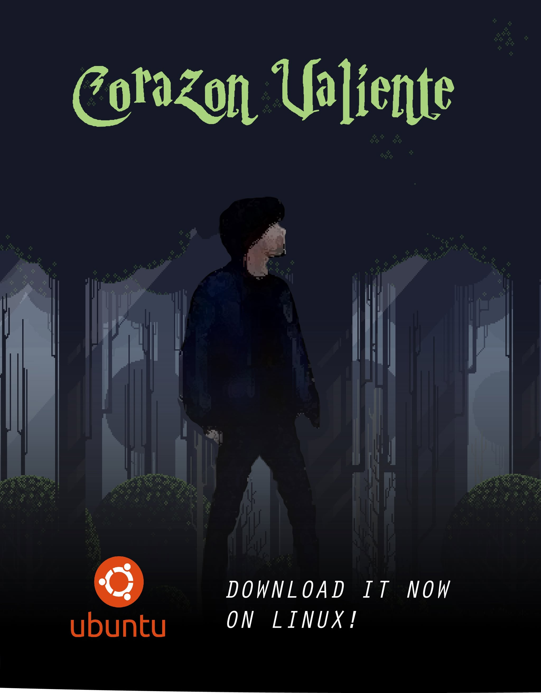

  <!-- Poster Image -->
  
  
  <!-- Typing Animation Text -->
  
  
    
  
  <!-- Brief Text Description -->
  <pre>
    💼 Cloud Computing Student at Esprit
    🖥️ Backend & Cloud Engineer
    📚 Passionate about DevOps & Automation
    🔧 OpenStack, Kubernetes, Prometheus, Grafana, and more
  </pre>
    
  
  <!-- Small gif for fun -->
  
  
     
  
  <!-- Social Links -->
  

    
    
    
  

<!-- Values Text -->

